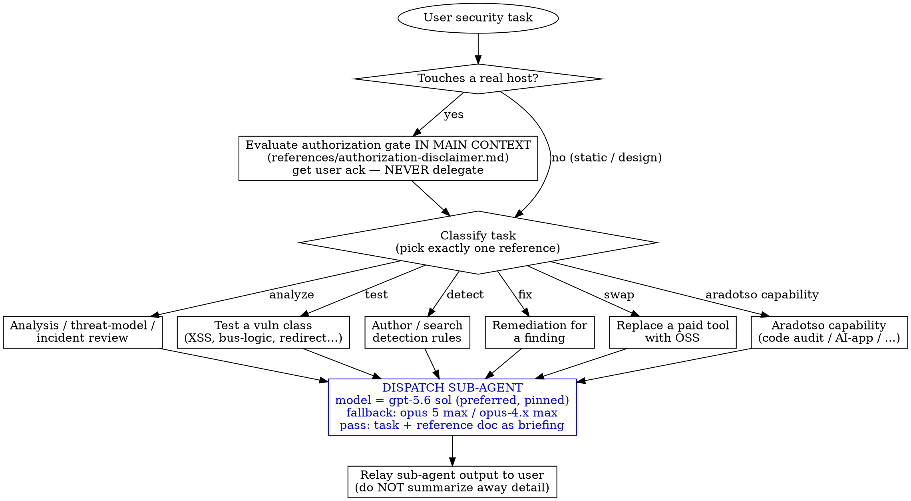

# Phase 3 — Skill architecture

> **Status:** 📋 Ready to execute (after plan approval).
>
> **Depends on:** [phase-1-research-baseline.md](phase-1-research-baseline.md).

## Purpose

Define the target plugin structure, progressive-disclosure contract, and the SKILL.md entrypoint's routing logic. Every content phase (4, 5, 6, 7, 8) produces files that fit into the tree defined here.

## Target directory tree

```
plugins/cybersecurity/
├── .claude-plugin/
│   └── plugin.json                              # Plugin manifest (see phase 10)
└── skills/
    └── cybersecurity/
        ├── SKILL.md                              # Entrypoint + routing (under 500 lines)
        ├── references/
        │   ├── authorization-disclaimer.md       # [phase 4] The gate content
        │   ├── analyst-reasoning.md              # [phase 5] From amplihack cybersecurity-analyst
        │   ├── testing-business-logic.md         # [phase 5] OSS-ported mukul975
        │   ├── testing-xss.md                    # [phase 5] OSS-ported mukul975 (DOM-Invader gap acknowledged)
        │   ├── testing-host-header.md            # [phase 5] OSS-ported mukul975
        │   ├── testing-open-redirect.md          # [phase 5] OSS-ported mukul975
        │   ├── testing-forced-browsing.md        # [phase 5] OSS-ported mukul975
        │   ├── detections-mcp.md                 # [phase 7] Aradotso MCP: local OSS + hosted optional
        │   ├── oss-tool-map.md                   # [phase 5] Burp/Collaborator/Nessus → OSS swap table
        │   ├── defensive-cross-refs.md           # [phase 8] Map findings → existing 5 plugins
        │   ├── aradotso-code-audit.md            # [phase 6] A1, A3, A4, A5, A6, A7, A8, A10
        │   ├── aradotso-agent-safety.md          # [phase 6] F2, G3
        │   ├── aradotso-compliance.md            # [phase 6] C1
        │   ├── aradotso-web-vuln-testing.md      # [phase 6] D1, D2, D3, D4
        │   └── aradotso-ai-security.md           # [phase 6] E1, E2, E3, E4
        └── scripts/                              # Only if a port needs a helper
            └── (e.g. race-condition-curl.sh)     # [phase 5] optional helper
```

## Conventions matched to the repo

The layout follows `plugins/api-security-hardening/` (the cleanest existing skill with `references/`) and `plugins/csrf-protection/` (the cleanest single-manifest pattern):

- `plugins/<name>/.claude-plugin/plugin.json` — required manifest.
- `plugins/<name>/skills/<name>/SKILL.md` — directory name **must match** plugin name for Claude auto-discovery.
- `references/*.md` — extended docs loaded on demand (progressive disclosure).
- `scripts/` — helper scripts only if a port needs reusable code (otherwise omitted).

## SKILL.md entrypoint design

The entrypoint is the only file always loaded when the skill triggers. It must:

1. **Stay under 500 lines** (per repo convention; matches `writing-skills` token-budget guidance).
2. **Frontmatter** — `name: cybersecurity`, plus a pushy `description` covering the trigger surface (OWASP, pentest, vulnerability, XSS, threat model, SAST, code audit, security review, etc.).
3. **Routing logic** — a small inline decision flowchart (DOT) that routes the agent to the right `references/*.md`. Never dumps all reference content into SKILL.md.
4. **Authorization gate hook** — for live-target tasks, route to `references/authorization-disclaimer.md` first (see phase 4).
5. **Cross-references** — explicit `SEE: references/<file>.md` markers; `REQUIRED SUB-SKILL: <name>` for repo-internal skill deps. Never `@` links.
6. **Sub-agent dispatch contract** — see §"Execution model" below. SKILL.md is a router + dispatcher, not an executor.

## Execution model — each reference doc runs as a sub-agent

> Locked decision #5 in ORCHESTRATION. This is the core runtime design, not an afterthought.

### Principle

Every reference doc is a **briefing for a dedicated sub-agent**, not text the main agent reads and acts on inline. The SKILL.md orchestrator:

1. Classifies the task (routing flowchart).
2. Checks the authorization gate if the task touches a real host (gate stays in main context — see below).
3. **Dispatches a sub-agent** with: (a) the user's task, (b) a pointer to the matching `references/<doc>.md`, (c) the model spec below.
4. Relays the sub-agent's output to the user.

The main context never loads the reference doc's body. This keeps the orchestrator lean (~500 lines) and lets each sub-task run with maximum dedicated context on a high-tier reasoning model.

### Model spec (locked)

Each sub-agent runs on the **highest reasoning tier available** from one of:

- **OpenAI:** **`gpt-5.6 sol`** — the pinned choice. (If unavailable in the runtime, fall back to the newest available GPT-5.x at its highest reasoning effort, and note the degradation in the dispatch log.)
- **Anthropic:** `claude-opus-4.x` at `max` reasoning, or **`opus 5 max`** (newest Opus at max effort) when available.
- If neither tier is available in the runtime, fall back to the highest available tier and note the degradation in the dispatch log.

The sub-agent invocation should pin the model + reasoning level explicitly (e.g. `model: "claude-opus-5-max"` or `model: "gpt-5", reasoning_effort: "xhigh"`). Don't leave it to defaults — deep security work needs the high tier.

### Why sub-agents (per `superpowers:dispatching-parallel-agents` / `subagent-driven-development`)

- **Context isolation.** A 2000-line XSS methodology + payload library doesn't pollute the orchestrator's working set. The orchestrator only needs the 30-line routing table.
- **Context budget.** Each sub-agent gets a fresh context window for its task. Large reference docs (analyst-reasoning.md is ~8500 words; testing-xss.md will be large too) fit comfortably.
- **Parallelism.** When the user asks for "audit this codebase for everything" the orchestrator can fan out parallel sub-agents (code-audit, XSS, host-header, open-redirect) that run simultaneously rather than serially.
- **Quality.** High-tier reasoning models (gpt-5.6 sol / opus 5 max) materially outperform mid-tier on adversarial security reasoning — finding the second-order vuln, the bypass chain, the race condition. Pinning them per-sub-agent is the lever.

### What stays in the main context

The orchestrator never delegates these (kept inline in SKILL.md or `references/authorization-disclaimer.md` loaded directly):

| Stays inline | Why |
|---|---|
| Routing decision (which reference matches this task) | Cheap; needs full task context. |
| Authorization gate (`authorization-disclaimer.md`) | **Safety-critical.** The gate must fire before any sub-agent dispatch for live-target tasks. Delegating it would create a TOCTOU window where a sub-agent runs against a real host before ack is confirmed. Gate evaluates in main context → only then does dispatch happen. |
| Ack-state tracking (per-session, per-target) | Small; needs to persist across the session's sub-agent calls. |
| Sub-agent dispatch + result relay | That's the orchestrator's whole job. |

### What gets delegated

Everything else. Each `references/*.md` doc is the sub-agent's briefing:

| Reference doc | Sub-agent does |
|---|---|
| `analyst-reasoning.md` | Runs the 11-step analytical framework (STRIDE/PASTA/VAST, MITRE ATT&CK mapping, CVSS/FAIR) on the user's incident or design. |
| `testing-xss.md` | Drives the OSS XSS workflow (ZAP + Dalfox + manual DOM source/sink analysis) against the target. |
| `testing-business-logic.md` | Maps the business workflow, generates curl test cases, runs them, analyzes results. |
| `testing-host-header.md` | Sets up interact.sh, runs the curl Host-header test matrix. |
| `testing-open-redirect.md` | Enumerates redirect params, runs payload matrix, analyzes results. |
| `testing-forced-browsing.md` | Drives ffuf/Gobuster/SecLists enumeration + auth-enforcement validation. |
| `oss-tool-map.md` | Answers "what's the OSS replacement for X?" — small lookup sub-agent. |
| `detections-mcp.md` | Wires up + queries the local MCP server, authors Sigma rules. |
| `defensive-cross-refs.md` | Maps a finding to the right existing defensive plugin (small lookup sub-agent). |
| `aradotso-*.md` (5 grouped docs) | Each runs the grouped capability (code audit, agent safety, compliance, web-vuln testing, AI-app security). |

### Dispatch protocol (what SKILL.md tells the orchestrator to do)

For each delegated task, the orchestrator's instruction in SKILL.md is essentially:

```text
When you route a task to references/<doc>.md:
1. (If live-target) Confirm authorization gate has been acked for this target this session.
2. Dispatch a sub-agent with:
   - task: <user's verbatim task + any collected context (code, URLs, target scope)>
   - briefing: load and pass the contents of references/<doc>.md
   - model: **gpt-5.6 sol** (preferred, pinned); fallback highest available of {opus 5 max, claude-opus-4.x max}
   - tools: <reference doc specifies which OSS tools the sub-agent may invoke>
   - return: findings + recommended remediation (with cross-refs to defensive plugins)
3. Relay the sub-agent's output to the user verbatim (do not summarize away detail).
4. (If live-target) Do not auto-dispatch follow-up live-target tasks without re-confirming scope.
```

The exact dispatch mechanics (Agent tool, Task tool, Codex sub-agent, Gemini spawn, etc.) are platform-specific — SKILL.md names the contract, the runtime implements it. Each `references/*.md` ends with a `## Sub-agent return contract` section specifying the output shape so the orchestrator knows what to relay.

### Fan-out for "audit everything" requests

When the user asks for broad coverage (e.g. "audit this codebase for security issues"), the orchestrator dispatches multiple sub-agents **in parallel** (single message, multiple dispatch tool calls) per `superpowers:dispatching-parallel-agents`:

- code-audit sub-agent (references/aradotso-code-audit.md)
- XSS sub-agent (references/testing-xss.md) — only if web app
- business-logic sub-agent (references/testing-business-logic.md) — only if stateful app
- AI-app sub-agent (references/aradotso-ai-security.md) — only if LLM app
- (etc.)

Each returns its findings; the orchestrator merges into a single report. Authorization gate fires once up front (covering all live-target sub-agents in the batch), not per sub-agent.

### How this changes the reference docs

Each `references/*.md` is no longer just "documentation the agent reads" — it's a **sub-agent briefing**. So each one adds:

1. **`## Sub-agent mission`** at the top — one paragraph: what this sub-agent is being dispatched to do.
2. **`## Inputs`** — what the orchestrator must pass (task, target, code, scope, ack-state).
3. **`## Tools`** — which OSS tools the sub-agent may invoke (and the install commands if missing).
4. **`## Methodology`** — the body (this is the existing content from phases 5/6/7/8).
5. **`## Sub-agent return contract`** — output shape: findings array, each with {vuln, severity, evidence, remediation, defensive-plugin-crossref}.

This makes each reference doc self-contained as a dispatchable unit, not just a readable doc.

### Proposed SKILL.md sections

```markdown
---
name: cybersecurity
description: <pushy description covering all trigger surfaces — see phase 10 for final wording>
license: MIT
metadata:
  keywords: "cybersecurity, security, OWASP, pentest, vulnerability, XSS, CSRF, SSRF, ..."
---

# Cybersecurity

## Overview
OSS-only unified cybersecurity skill: analyze, test, and harden software security
using exclusively open-source tooling. Covers threat modeling, code review, web-vuln
testing, AI-app security, and detection engineering.

## When to use
- Bulleted trigger list (web vuln testing, code audit, threat modeling, etc.)
- When NOT to use (infra/IT-only security, malware analysis — see exclusions)

## Authorization gate (live-target tasks only)
For any task touching a real host (ffuf/nuclei/ZAP/dalfox/interact.sh):
**Evaluate the gate IN THIS MAIN CONTEXT** by loading
SEE: references/authorization-disclaimer.md — read + acknowledge before dispatching
any sub-agent. The gate is NEVER delegated (safety: prevents a sub-agent touching a
real host before ack is confirmed). Static analysis, SAST, threat modeling,
secure-design, detection-rule authoring require no gate.

## Execution model (decision #5)
This skill is a ROUTER + DISPATCHER, not an executor. For every reference doc below,
the orchestrator DISPATCHES A SUB-AGENT running on the highest reasoning tier
available (**`gpt-5.6 sol`** preferred / `claude-opus-4.x max` / `opus 5 max`), passing the
user's task + the reference doc as the briefing. The main context never inlines a
reference doc's body. Exception: the authorization gate above runs inline.

For "audit everything" requests, fan out multiple sub-agents in parallel (single
message, multiple dispatch calls) per superpowers:dispatching-parallel-agents.

## Routing
<inline DOT flowchart: task type → which reference doc to DISPATCH a sub-agent with>

| Task | Dispatch sub-agent with this briefing |
|---|---|
| Analyze an incident / threat-model a feature | references/analyst-reasoning.md |
| Test business-logic flaws | references/testing-business-logic.md |
| Test XSS | references/testing-xss.md |
| Test Host header injection | references/testing-host-header.md |
| Test open redirect | references/testing-open-redirect.md |
| Find unprotected endpoints (forced browsing) | references/testing-forced-browsing.md |
| Author / search detection rules | references/detections-mcp.md |
| Map finding → existing defensive fix | references/defensive-cross-refs.md |
| Replace a paid tool with OSS | references/oss-tool-map.md |
| Code audit / SAST (Semgrep, multi-agent audit, falsification scan) | references/aradotso-code-audit.md |
| Agent / "vibe-coded" app safety review | references/aradotso-agent-safety.md |
| Compliance (OWASP, CVE, GDPR/SOC2/ISO27001, threat modeling, IR) | references/aradotso-compliance.md |
| Web/API vuln testing tools + Academy walkthroughs | references/aradotso-web-vuln-testing.md |
| AI-app security (LLM red-team, OWASP LLM Top 10, references) | references/aradotso-ai-security.md |

## OSS-only pledge
This skill uses exclusively open-source tooling. Paid tools (Burp, Nessus, Splunk,
CrowdStrike, etc.) appear only as "if you already have it" notes — never as the
primary path. For the full paid→OSS swap table, SEE: references/oss-tool-map.md.
```

## Routing flowchart (DOT, embedded in SKILL.md)



The dispatch step (blue) is the core of decision #5: the orchestrator never inlines a reference doc, it hands it to a dedicated high-tier sub-agent. "Audit everything" requests fan out to multiple `dispatch` calls in parallel.

May also dispatch a small `oss-tool-map.md` lookup sub-agent alongside any `testing-*.md` sub-agent to surface OSS alternatives mid-workflow.

## Progressive-disclosure contract

| Layer | When loaded | Token budget |
|---|---|---|
| Metadata (`name`, `description`) | Always in context | ~100 words |
| `SKILL.md` body (router + dispatcher + gate) | When skill triggers | Under 500 lines (~5k words) |
| `references/authorization-disclaimer.md` | Loaded inline in main context when task touches a real host | Small (~100 lines) — gate is cheap, safety-critical |
| One `references/*.md` (all others) | **Passed as briefing to a dispatched sub-agent** — never inlined in main context | Self-contained, no fixed cap |
| `scripts/*` | When a sub-agent invokes it | Only if needed |

### Rules

- Each reference doc is **self-contained as a sub-agent briefing** — usable without loading other references. Cross-refs use `SEE:` markers the sub-agent may follow.
- **No `@` links** anywhere (force-loads, burns context).
- Reference docs never re-state content from SKILL.md — they extend it.
- The entrypoint never inlines reference content — it **dispatches a sub-agent** with the reference as briefing.
- Each `references/*.md` ends with a `## Sub-agent return contract` section (output shape) so the orchestrator knows what to relay.

## Naming and discovery (CSO)

Per `writing-skills` Claude Search Optimization guidance:

- **Name:** `cybersecurity` (single word, broad, memorable).
- **Description:** pushy, third-person, lists concrete triggers (OWASP Top 10, pentest, vulnerability testing, XSS/SSRF/CSRF, SAST, code audit, threat modeling, incident review, detection engineering, MITRE ATT&CK, Sigma). Mentions both "find" and "fix" verbs.
- **Keywords array** in `plugin.json` and `marketplace.json`: starts with `cybersecurity`, then OWASP, pentest, vulnerability, XSS, SSRF, CSRF, business-logic, host-header, open-redirect, forced-browsing, threat-modeling, STRIDE, MITRE-ATT&CK, Sigma, SAST, Dalfox, ZAP, ffuf, nuclei, interact.sh, code-audit, etc.

## File ownership map (which phase produces each file)

| File | Produced by |
|---|---|
| `plugins/cybersecurity/.claude-plugin/plugin.json` | phase 10 |
| `skills/cybersecurity/SKILL.md` | phase 3 (this phase — skeleton) + refined by phases 4–8 (routing entries) |
| `references/authorization-disclaimer.md` | phase 4 |
| `references/analyst-reasoning.md` | phase 5 |
| `references/testing-business-logic.md` | phase 5 |
| `references/testing-xss.md` | phase 5 |
| `references/testing-host-header.md` | phase 5 |
| `references/testing-open-redirect.md` | phase 5 |
| `references/testing-forced-browsing.md` | phase 5 |
| `references/oss-tool-map.md` | phase 5 (centralized swap table; data from phase 1) |
| `references/detections-mcp.md` | phase 7 |
| `references/defensive-cross-refs.md` | phase 8 |
| `references/aradotso-code-audit.md` | phase 6 (A1, A3, A4, A5, A6, A7, A8, A10) |
| `references/aradotso-agent-safety.md` | phase 6 (F2, G3) |
| `references/aradotso-compliance.md` | phase 6 (C1) |
| `references/aradotso-web-vuln-testing.md` | phase 6 (D1, D2, D3, D4) |
| `references/aradotso-ai-security.md` | phase 6 (E1, E2, E3, E4) |
| `scripts/*` | phase 5 (optional, only if a port needs a helper) |

## Things I will NOT do (this phase)

- Will NOT write the actual SKILL.md content — this phase defines the **architecture and contract**. Content lands in phases 4–8.
- Will NOT register the plugin in `marketplace.json` (phase 10).
- Will NOT use `@` links anywhere.
- Will NOT exceed 500 lines in SKILL.md.
- Will NOT inline reference content into SKILL.md — routing only.
- Will NOT commit — file lands in working tree for review.
