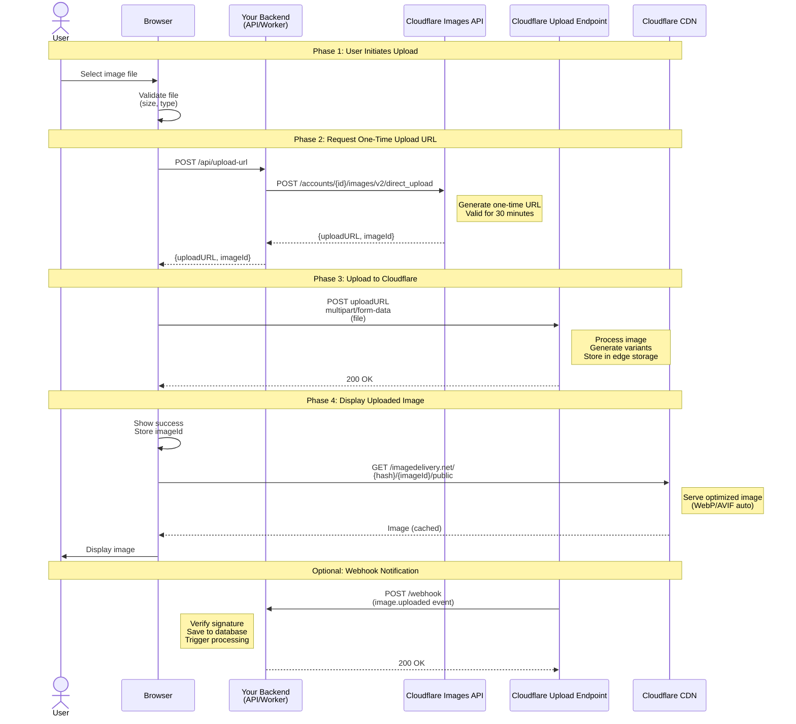

# Direct Creator Upload Workflow

Visual architecture for Cloudflare Images Direct Creator Upload pattern (frontend + backend).

## Workflow Diagram



## Key Benefits

1. **Secure**: Upload URLs are one-time use, expire after 30 minutes
2. **Scalable**: Direct upload to Cloudflare edge, no backend bottleneck
3. **Fast**: Parallel upload + CDN delivery
4. **Reliable**: Cloudflare handles all image processing

## Implementation Steps

### 1. Backend: Generate Upload URL

```typescript
// POST /api/upload-url
const response = await fetch(
  `https://api.cloudflare.com/client/v4/accounts/${accountId}/images/v2/direct_upload`,
  {
    method: 'POST',
    headers: { 'Authorization': `Bearer ${apiToken}` },
    body: JSON.stringify({ requireSignedURLs: false })
  }
);

const { uploadURL, id } = (await response.json()).result;
return { uploadURL, imageId: id };
```

### 2. Frontend: Upload to Cloudflare

```typescript
// Get upload URL from backend
const { uploadURL, imageId } = await fetch('/api/upload-url', {
  method: 'POST'
}).then(r => r.json());

// Upload file directly to Cloudflare
const formData = new FormData();
formData.append('file', file);

await fetch(uploadURL, {
  method: 'POST',
  body: formData
});

// Display uploaded image
const imageUrl = `https://imagedelivery.net/${accountHash}/${imageId}/public`;
```

### 3. Backend: Handle Webhook (Optional)

```typescript
// POST /webhook
const signature = request.headers.get('X-Cloudflare-Signature');
const body = await request.text();

// Verify signature
const isValid = await verifySignature(body, signature, webhookSecret);

if (isValid) {
  const { image } = JSON.parse(body);
  // Save to database, trigger processing, etc.
  await db.images.create({ cloudflareId: image.id });
}
```

## Security Considerations

- **Upload URL**: One-time use, expires after 30 minutes
- **CORS**: Configure allowed origins on backend
- **File Validation**: Validate size and type client-side AND server-side
- **Webhook Signature**: Always verify HMAC-SHA256 signature
- **Rate Limiting**: Implement on upload URL generation endpoint

## Performance Optimizations

- **Parallel Upload**: Upload happens directly to Cloudflare edge
- **CDN Caching**: Images cached at edge locations worldwide
- **Format Auto-Negotiation**: WebP/AVIF served automatically
- **Lazy Loading**: Load images as user scrolls

## Error Handling

### Common Errors

1. **Upload URL Expired**: Generate new URL (after 30 minutes)
2. **File Too Large**: Validate < 10MB before upload
3. **Invalid File Type**: Accept only JPEG, PNG, GIF, WebP
4. **CORS Error**: Configure CORS headers on backend
5. **Network Failure**: Implement retry with exponential backoff

### Example Error Handling

```typescript
async function uploadWithRetry(file: File, maxRetries = 3) {
  for (let attempt = 1; attempt <= maxRetries; attempt++) {
    try {
      const { uploadURL, imageId } = await getUploadURL();
      await uploadToCloudflare(uploadURL, file);
      return imageId;
    } catch (error) {
      if (attempt === maxRetries) throw error;
      await delay(Math.pow(2, attempt) * 1000);
    }
  }
}
```

## Related References

- **Complete Guide**: `references/direct-upload-complete-workflow.md`
- **Backend Template**: `templates/worker-upload.ts`
- **Frontend Template**: `templates/direct-upload-frontend.html`
- **Webhook Handler**: `templates/webhook-handler.ts`

## Related Diagrams

- **Transformation Pipeline**: `diagrams/transformation-pipeline.md`
- **Variants Architecture**: `diagrams/variants-structure.md`
