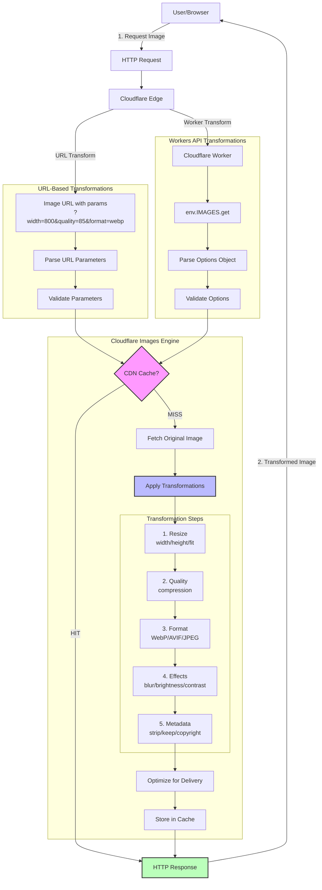
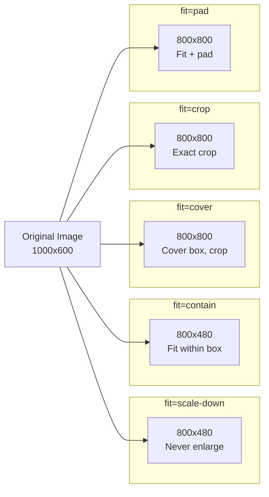
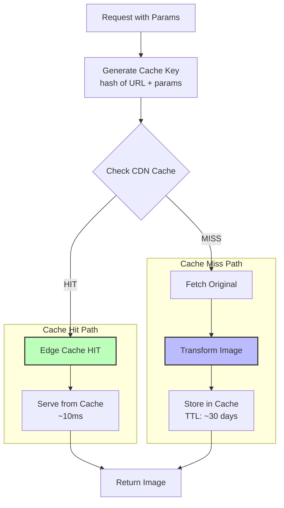

# Cloudflare Images Transformation Pipeline

Visual architecture showing how Cloudflare Images processes transformation requests using URL-based transformations vs Workers API.

## Transformation Pipeline Diagram



## Two Transformation Methods

### Method 1: URL-Based Transformations (Recommended)

**Use Case**: Frontend image delivery (HTML, React, Vue, etc.)

**Example**:
```html

```

**Pros**:
- Simple to use
- No backend code required
- Automatic caching
- Works in any framework

**Cons**:
- Limited to URL parameters
- Cannot use complex logic

### Method 2: Workers API Transformations

**Use Case**: Backend processing, dynamic transformations, complex logic

**Example**:
```typescript
// In Cloudflare Worker
const image = await env.IMAGES.get(imageId, {
  cf: {
    image: {
      width: 800,
      quality: 85,
      format: 'auto'
    }
  }
});

return new Response(image.body, {
  headers: { 'Content-Type': 'image/jpeg' }
});
```

**Pros**:
- Programmatic control
- Can use complex logic
- Integrate with auth, watermarking, etc.

**Cons**:
- Requires Cloudflare Worker
- More complex setup

## Transformation Parameters

### Dimensions

```
width: 1-9999 pixels
height: 1-9999 pixels
```

### Fit Modes



### Quality

```
quality: 1-100
  - 60-70: High compression (visible artifacts)
  - 80-85: Optimal (recommended)
  - 90-95: High quality (larger file)
  - 100: No compression (not recommended)
```

### Format

```
format: auto | webp | avif | jpeg | png
  - auto: WebP/AVIF based on Accept header (recommended)
  - webp: 25-35% smaller than JPEG
  - avif: 50% smaller than JPEG
  - jpeg: Universal compatibility
  - png: Transparency support
```

### Effects

```
blur: 1-250 pixels
brightness: -100 to 100
contrast: -100 to 100
gamma: 0.1 to 2.0
```

## Caching Strategy



### Cache Behavior

- **Cache Key**: URL + all transformation parameters
- **TTL**: ~30 days for transformed images
- **Purge**: Update original → invalidates all variants
- **Global**: Cached at 300+ edge locations worldwide

## Performance Optimization Tips

### 1. Use Format Auto-Negotiation

```html
<!-- Automatically serves WebP/AVIF based on browser -->

```

**Savings**: 25-50% file size reduction

### 2. Set Appropriate Quality

```html
<!-- Thumbnails: Lower quality acceptable -->


<!-- Hero images: Higher quality -->

```

**Savings**: 30-50% file size at quality=85 vs 100

### 3. Use Responsive Images

```html

```

**Savings**: Only load appropriate size for device

### 4. Lazy Load Below-Fold Images

```html

```

**Savings**: Defer loading until needed

## Error Codes

### Transformation Errors (9400-9413)

```
9401: Invalid width (must be 1-9999)
9402: Invalid height (must be 1-9999)
9403: Invalid fit (must be scale-down/contain/cover/crop/pad)
9404: Invalid quality (must be 1-100)
9406: Invalid background color (must be hex format)
9408: Invalid trim value
9411: Invalid rotation (must be 90/180/270/auto)
9412: Invalid brightness (-100 to 100)
9413: Invalid contrast (-100 to 100)
```

### Resolution

Load `references/top-errors.md` for complete error solutions.

## Implementation Examples

### React Component

```typescript
interface CloudflareImageProps {
  imageId: string;
  width?: number;
  quality?: number;
  format?: 'auto' | 'webp' | 'avif' | 'jpeg';
}

export function CloudflareImage({
  imageId,
  width = 800,
  quality = 85,
  format = 'auto'
}: CloudflareImageProps) {
  const params = new URLSearchParams({
    width: width.toString(),
    quality: quality.toString(),
    format
  });

  const url = `https://imagedelivery.net/${ACCOUNT_HASH}/${imageId}/public?${params}`;

  return ;
}
```

### Cloudflare Worker

```typescript
export default {
  async fetch(request: Request, env: Env) {
    const url = new URL(request.url);
    const imageId = url.pathname.slice(1);

    // Dynamic transformation based on request
    const isMobile = /mobile/i.test(request.headers.get('user-agent') || '');

    const image = await env.IMAGES.get(imageId, {
      cf: {
        image: {
          width: isMobile ? 400 : 800,
          quality: isMobile ? 80 : 85,
          format: 'auto'
        }
      }
    });

    return new Response(image.body, {
      headers: {
        'Content-Type': 'image/jpeg',
        'Cache-Control': 'public, max-age=31536000'
      }
    });
  }
};
```

## Related References

- **Transformation Options**: `references/transformation-options.md`
- **Format Optimization**: `references/format-optimization.md`
- **Top Errors**: `references/top-errors.md`
- **API Reference**: `references/api-reference.md`

## Related Diagrams

- **Direct Upload Workflow**: `diagrams/direct-upload-workflow.md`
- **Variants Architecture**: `diagrams/variants-structure.md`
