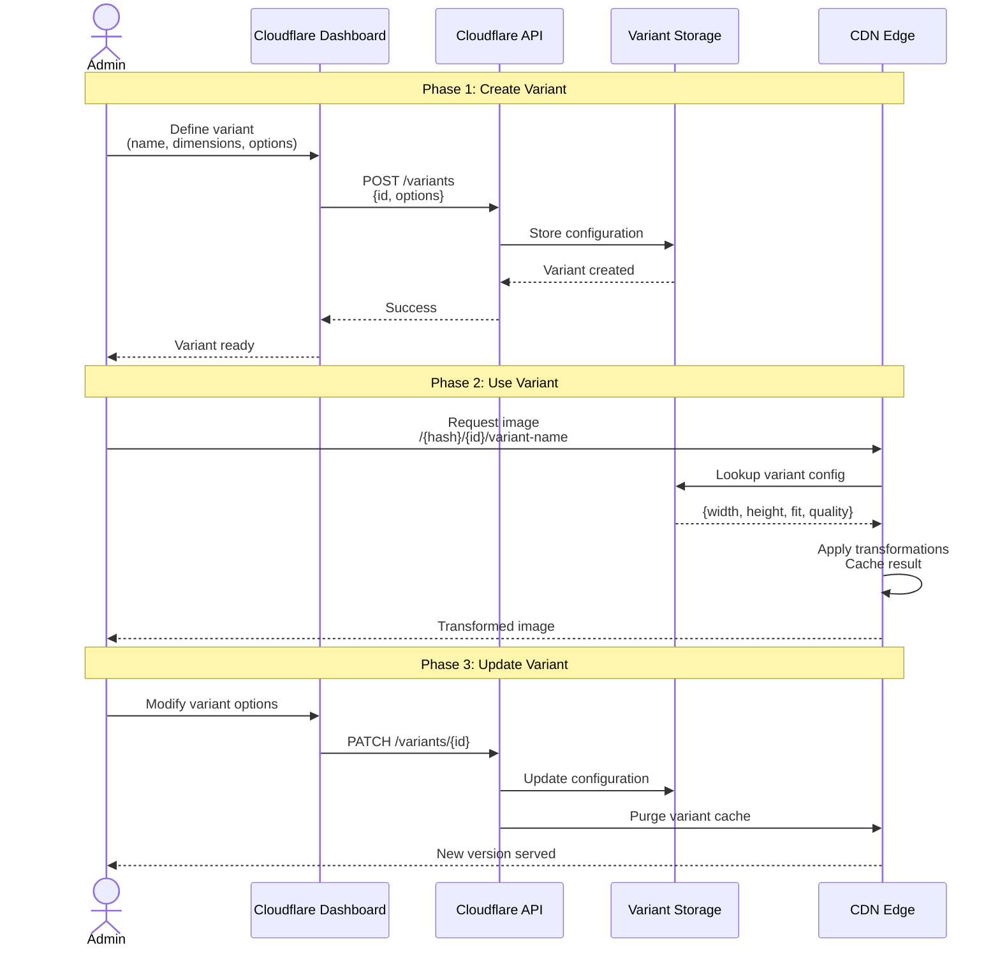
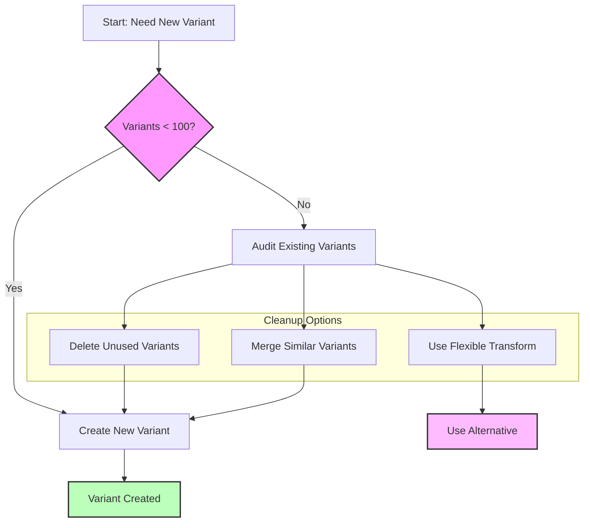
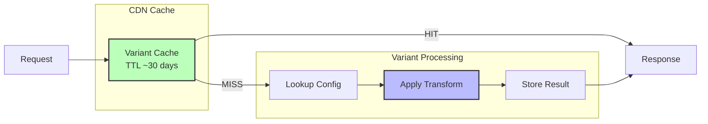

# Cloudflare Images Variants Architecture

Visual architecture comparing Named Variants vs Flexible Transformations, including variant configuration, management, and usage patterns.

## Variants Architecture Overview

```mermaid
flowchart TB
    Upload[Image Upload]

    subgraph "Cloudflare Images Storage"
        Original[Original Image<br/>Stored Once]
    end

    subgraph "Named Variants"
        Config[Variant Configuration<br/>Max 100 variants]

        V1[thumbnail<br/>300x300 cover q=80]
        V2[medium<br/>800x800 scale-down q=85]
        V3[large<br/>1600x1600 scale-down q=90]
        V4[avatar-sm<br/>48x48 cover q=80]
        V5[Custom variants...]

        Config --> V1
        Config --> V2
        Config --> V3
        Config --> V4
        Config --> V5
    end

    subgraph "Flexible Transformations"
        URL1[URL: ?width=400&quality=80]
        URL2[URL: ?width=800&quality=85&format=webp]
        URL3[URL: ?width=1200&fit=cover&blur=20]
        URL4[Any combination...]
    end

    subgraph "Delivery URLs"
        Named1[imagedelivery.net/{hash}/{id}/thumbnail]
        Named2[imagedelivery.net/{hash}/{id}/medium]
        Flex1[imagedelivery.net/{hash}/{id}/public?width=400]
        Flex2[imagedelivery.net/{hash}/{id}/public?width=800&fit=cover]
    end

    Upload --> Original
    Original --> Config
    Original --> URL1

    V1 -.-> Named1
    V2 -.-> Named2
    URL1 -.-> Flex1
    URL2 -.-> Flex2

    style Original fill:#bbf,stroke:#333,stroke-width:2px
    style Config fill:#f9f,stroke:#333,stroke-width:2px
    style Named1 fill:#bfb,stroke:#333,stroke-width:2px
    style Flex1 fill:#fbf,stroke:#333,stroke-width:2px
```

## Named Variants vs Flexible Transformations

### Named Variants

**Use Case**: Pre-defined sizes you use frequently

**Pros**:
- ✅ Shorter URLs
- ✅ Consistent sizing across app
- ✅ Easier to manage centrally
- ✅ Can require signed URLs per-variant

**Cons**:
- ❌ Limited to 100 variants max
- ❌ Requires API call to create
- ❌ Less flexible (fixed parameters)

**Example**:
```html
<!-- Named variant -->

```

### Flexible Transformations

**Use Case**: Dynamic transformations, one-off sizes

**Pros**:
- ✅ Unlimited combinations
- ✅ No setup required
- ✅ Dynamic parameters
- ✅ Great for responsive images

**Cons**:
- ❌ Longer URLs
- ❌ Potential for parameter misuse
- ❌ Harder to enforce consistency

**Example**:
```html
<!-- Flexible transformation -->

```

## Variant Configuration Workflow



## Variant Limit Management



### Variant Limit Best Practices

**100 Variant Limit**: Plan carefully

1. **Common Sizes Only**: Create variants for 80% use cases
2. **Flexible for Edge Cases**: Use URL params for one-off sizes
3. **Regular Audit**: Delete unused variants
4. **Naming Convention**: Consistent naming (e.g., `product-sm`, `product-md`, `product-lg`)

## Recommended Variant Sets

### E-Commerce Product Images

```json
{
  "product-thumb": { "width": 150, "height": 150, "fit": "cover", "quality": 80 },
  "product-sm": { "width": 300, "height": 300, "fit": "cover", "quality": 85 },
  "product-md": { "width": 600, "height": 600, "fit": "scale-down", "quality": 85 },
  "product-lg": { "width": 1200, "height": 1200, "fit": "scale-down", "quality": 90 },
  "product-zoom": { "width": 2400, "height": 2400, "fit": "scale-down", "quality": 95 }
}
```
**Variants Used**: 5/100

### User Avatars

```json
{
  "avatar-xs": { "width": 24, "height": 24, "fit": "cover", "quality": 75 },
  "avatar-sm": { "width": 48, "height": 48, "fit": "cover", "quality": 80 },
  "avatar-md": { "width": 96, "height": 96, "fit": "cover", "quality": 85 },
  "avatar-lg": { "width": 192, "height": 192, "fit": "cover", "quality": 85 },
  "avatar-xl": { "width": 384, "height": 384, "fit": "cover", "quality": 90 }
}
```
**Variants Used**: 5/100

### Blog/Content Images

```json
{
  "content-thumb": { "width": 400, "height": 225, "fit": "cover", "quality": 80 },
  "content-mobile": { "width": 768, "fit": "scale-down", "quality": 85 },
  "content-tablet": { "width": 1024, "fit": "scale-down", "quality": 85 },
  "content-desktop": { "width": 1600, "fit": "scale-down", "quality": 90 }
}
```
**Variants Used**: 4/100

### Hero/Banner Images

```json
{
  "hero-mobile": { "width": 768, "height": 432, "fit": "cover", "quality": 85 },
  "hero-tablet": { "width": 1024, "height": 576, "fit": "cover", "quality": 90 },
  "hero-desktop": { "width": 1920, "height": 1080, "fit": "cover", "quality": 90 },
  "hero-4k": { "width": 3840, "height": 2160, "fit": "cover", "quality": 95 }
}
```
**Variants Used**: 4/100

## Variant Management API

### Create Variant

```bash
curl -X POST \
  "https://api.cloudflare.com/client/v4/accounts/${CF_ACCOUNT_ID}/images/v1/variants" \
  -H "Authorization: Bearer ${CF_API_TOKEN}" \
  -H "Content-Type: application/json" \
  -d '{
    "id": "thumbnail",
    "options": {
      "width": 300,
      "height": 300,
      "fit": "cover",
      "metadata": "none"
    },
    "neverRequireSignedURLs": true
  }'
```

### List Variants

```bash
curl -X GET \
  "https://api.cloudflare.com/client/v4/accounts/${CF_ACCOUNT_ID}/images/v1/variants" \
  -H "Authorization: Bearer ${CF_API_TOKEN}"
```

### Update Variant

```bash
curl -X PATCH \
  "https://api.cloudflare.com/client/v4/accounts/${CF_ACCOUNT_ID}/images/v1/variants/thumbnail" \
  -H "Authorization: Bearer ${CF_API_TOKEN}" \
  -H "Content-Type: application/json" \
  -d '{
    "options": {
      "width": 350,
      "height": 350,
      "fit": "cover",
      "quality": 85
    }
  }'
```

### Delete Variant

```bash
curl -X DELETE \
  "https://api.cloudflare.com/client/v4/accounts/${CF_ACCOUNT_ID}/images/v1/variants/thumbnail" \
  -H "Authorization: Bearer ${CF_API_TOKEN}"
```

## Variant Usage Patterns

### Pattern 1: Named Variants with srcset

```html

```

### Pattern 2: Flexible Transformations with srcset

```html

```

### Pattern 3: Hybrid Approach (Recommended)

```typescript
// Named variants for common sizes
const VARIANTS = {
  thumbnail: 'product-thumb',
  small: 'product-sm',
  medium: 'product-md',
  large: 'product-lg'
};

// Flexible for one-off sizes
function getImageUrl(imageId: string, size: number | keyof typeof VARIANTS) {
  const baseUrl = `https://imagedelivery.net/${ACCOUNT_HASH}/${imageId}`;

  if (typeof size === 'string' && size in VARIANTS) {
    // Use named variant
    return `${baseUrl}/${VARIANTS[size]}`;
  } else {
    // Use flexible transformation
    return `${baseUrl}/public?width=${size}&quality=85&format=auto`;
  }
}

// Usage
  // Named variant
        // Flexible transform
```

## Variant Caching Behavior



### Cache Keys

- **Named Variant**: `{imageId}/{variantName}`
- **Flexible**: `{imageId}/public?{sortedParams}`

### Cache Invalidation

- **Update Variant**: Purges all cached images for that variant
- **Delete Original**: Purges all variants
- **Manual Purge**: API endpoint available

## Related References

- **Variants Guide**: `references/variants-guide.md`
- **Transformation Options**: `references/transformation-options.md`
- **Responsive Images**: `references/responsive-images-patterns.md`
- **API Reference**: `references/api-reference.md`

## Related Diagrams

- **Direct Upload Workflow**: `diagrams/direct-upload-workflow.md`
- **Transformation Pipeline**: `diagrams/transformation-pipeline.md`

## Related Commands

- **Generate Variant**: `/generate-variant` - Interactive variant creator
- **Check Images**: `/check-images` - List all configured variants
